## 目录
- 1.前言
- 2.测试方式
  - 2.1.硬件配置
- 3.写性能
- 4.读性能
  - 4.1.数据远小于内存（内存64GB）
  - 4.2.数据略小于内存（内存8GB）
  - 4.3.数据略大于内存（内存4GB）
  - 4.4.数据远大于内存（内存2GB）

## 1.前言
我们将 TerarkDB 集成到了 MongoDB 社区版中，后续我们会逐步发布性能测试报告。
- [TerarkDB](https://github.com/Terark/terark-zip-table) 是我们替换了 RocksDB 的 SST (Static Sorted Table) 后的产品
- [Mongo-Rocks](https://github.com/mongodb-partners/mongo-rocks) 是 Facebook 官方适配 RocksDB 作为 MongoDB 存储引擎的产品
- [Mongo-Terocks](https://github.com/Terark/mongo-rocks) 指使用 TerarkDB 的 Mongo-Rocks
- [MongoDB](https://github.com/mongodb/mongo) 版本为 [r3.5.4](https://github.com/mongodb/mongo/tree/r3.5.4)

## 2.测试方式
- 测试工具
  - YCSB([https://github.com/Terark/YCSB-mongo](https://github.com/Terark/YCSB-mongo))
- 测试数据
  - 由于YCSB的数据都是纯随机字符串生成的，离用户的真实场景相差较大，我们采用了[Amazon movie data (~8 million reviews)](https://snap.stanford.edu/data/web-Movies.html)数据进行测试
- 测试数据集尺寸
  - 约为9.1GB
  - 约800万条数据
  - 平均每条数据大约1KB
- 测试使用的引擎
  - MongoDB 默认存储引擎 WiredTiger
  - Facebook 的 [Mongo-Rocks](https://github.com/mongodb-partners/mongo-rocks)
  - Terark 的 [Mongo-Terocks](https://github.com/Terark/mongo-rocks)
- 读性能测试均是**均匀分布**与**齐普夫(Zipf)分布**测试
- 这里测量了读95/99分位延迟数据

### 2.1.硬件配置
- Intel(R) Core(TM) i7-6700K CPU @ 4.00GHz
- Kingston 16G @ 2133 MHz x4 (64G Total)
- SanDisk SD8SBAT256G1122 (256G SSD)
- Ubuntu 16.04.2 LTS

## 3.写性能
- 以下为**写入速度**与**95/99分位延迟数据**：
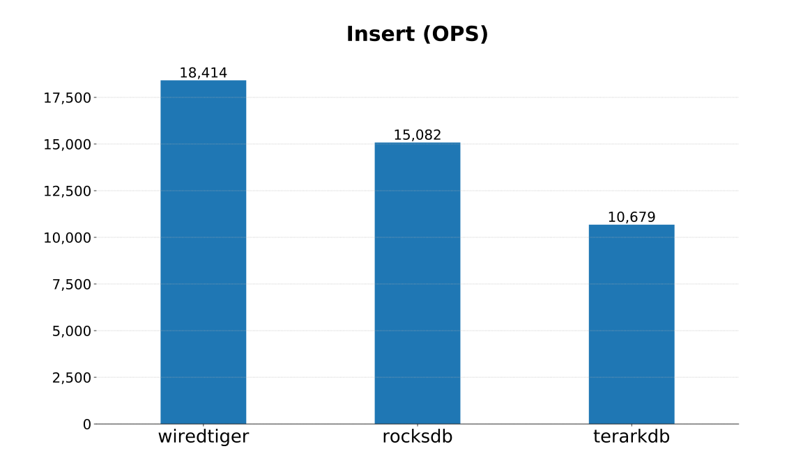
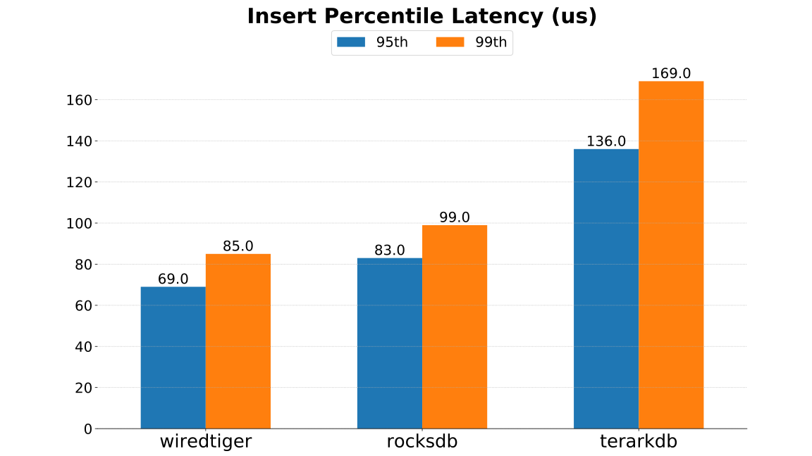

## 4.读性能
我们在开始读性能测试之前，首先批量的将所有数据写入数据库，然后重启服务器后开始测试。需要注意的是，除了数据远小于内存，其它的的读测试均是**均匀分布**与**齐普夫分布**测试。

- 内存受限情况，我们使用虚拟机达成
- 其中 RocksDB 开启 allow_mmap_reads 选项，BlockSize 为 4k
- WiredTiger 与 TerarkDB 使用默认配置选项

### 4.1.数据远小于内存（内存64GB）
- 以下为**数据压缩后大小**与**内存占用**：
- 由于压缩后数据库的尺寸(Storage Size)与读测试的内存限制无关，后面不再重复 Storage Size 图表
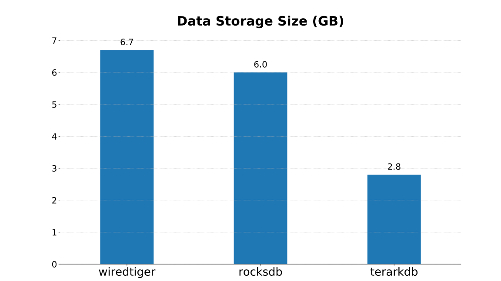
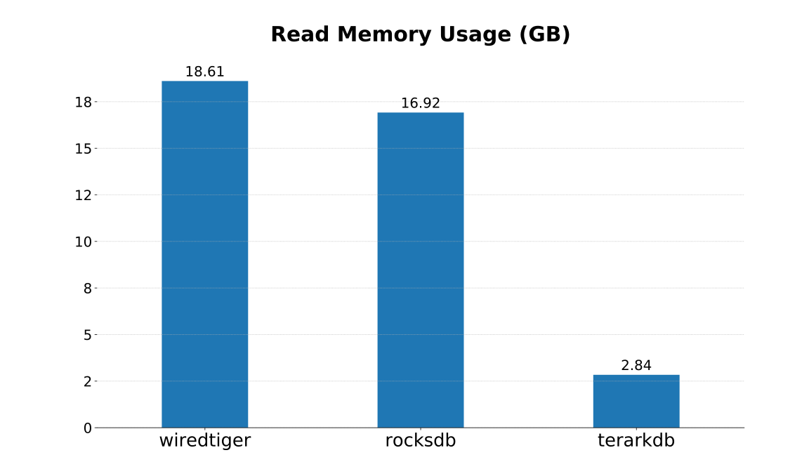

- 后续所有测试都使用同一份数据
- YCSB客户端全程占用 240% 以上CPU
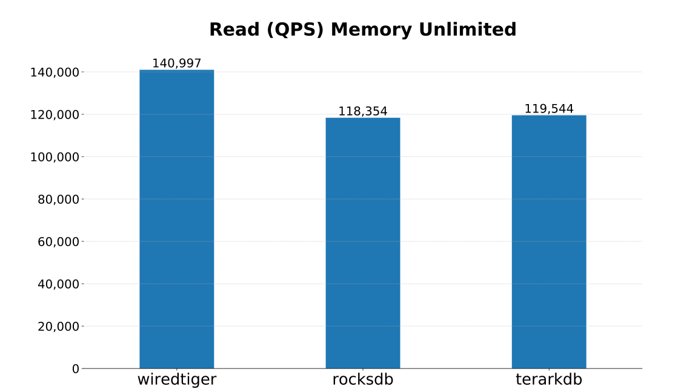
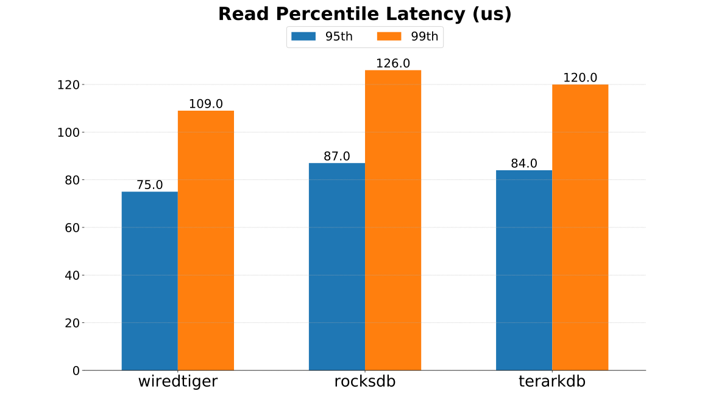

### 4.2.数据略小于内存（内存8GB）
- 此种情况下内存比数据略大，设置数据库专用缓存(缓存解压后的数据) 4G 
   - （Wiredtiger 和 RocksDB 官方均推荐配置该缓存占物理内存一半）
- TerarkDB 需要的内存只有 2.84G，远小于8G，不影响性能
- 读95/99分位延迟数据为均匀分布测试结果
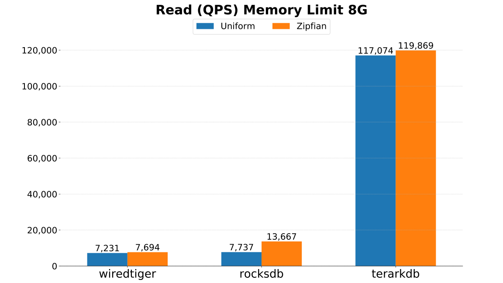
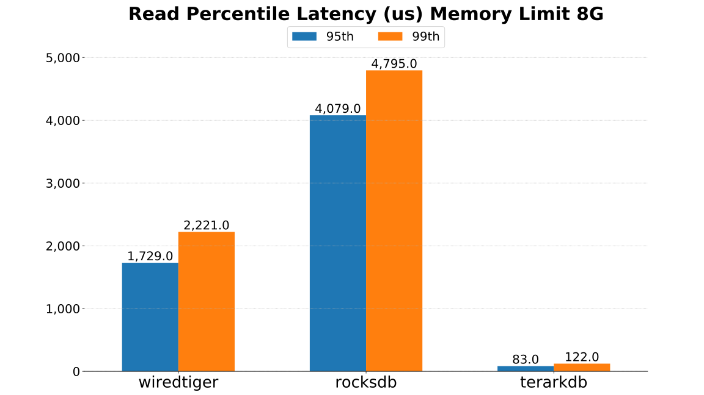

### 4.3.数据略大于内存（内存4GB）
- 此种情况下内存比数据略大，设置缓存2G
- TerarkDB 需要的内存只有 2.84G，远小于4G，不影响性能
- 读95/99分位延迟数据为均匀分布测试结果
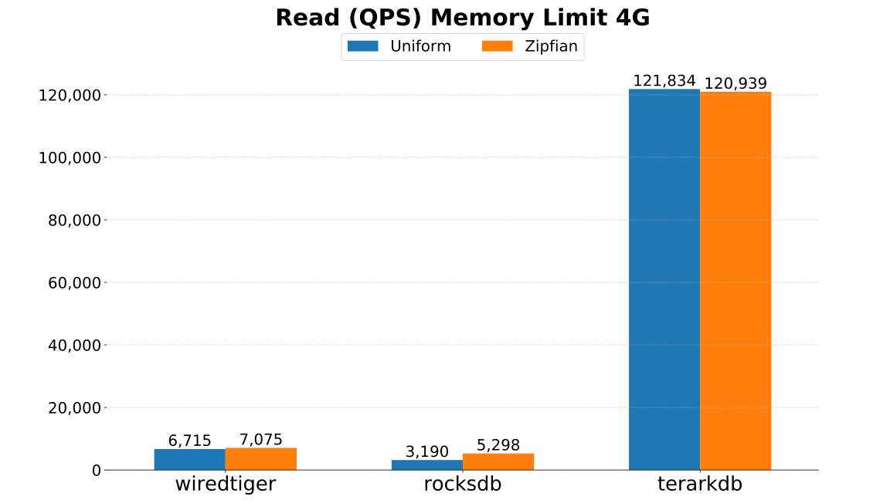
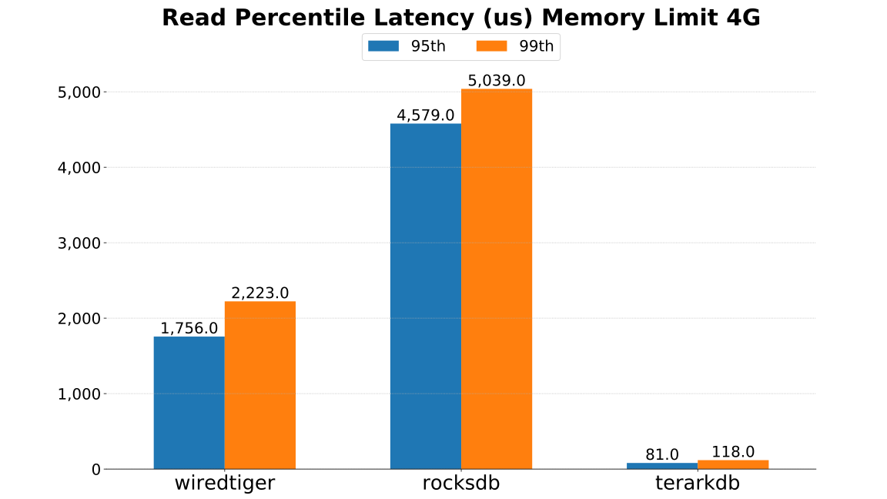

### 4.4.数据大于内存（内存2GB）
- 此种情况下所有存储引擎都达不到需要的内存
- 瓶颈在于文件IO，所有引擎的速度严重下降
- 读95/99分位延迟数据为均匀分布测试结果
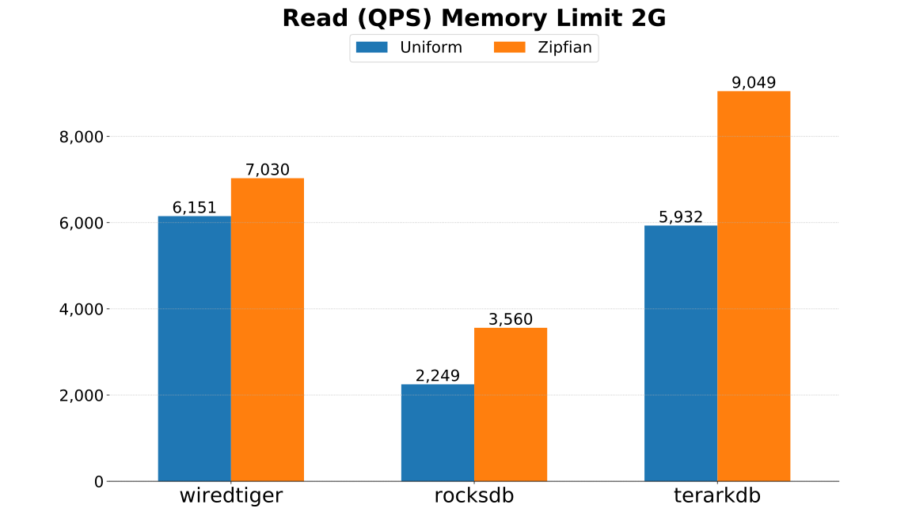
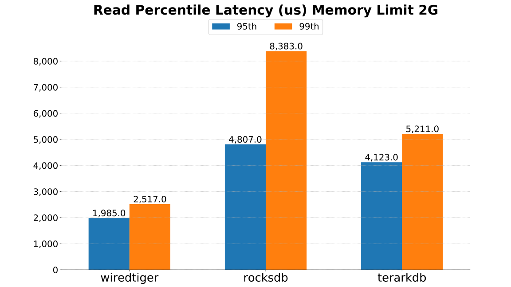

